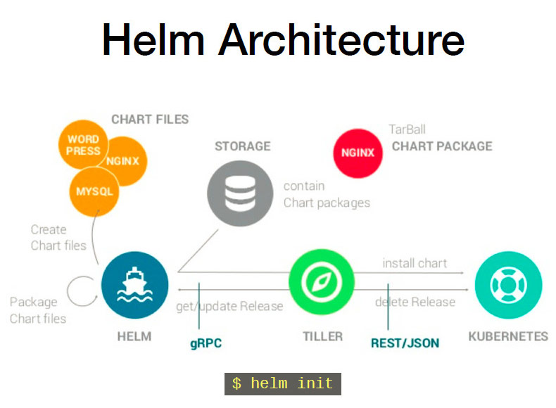
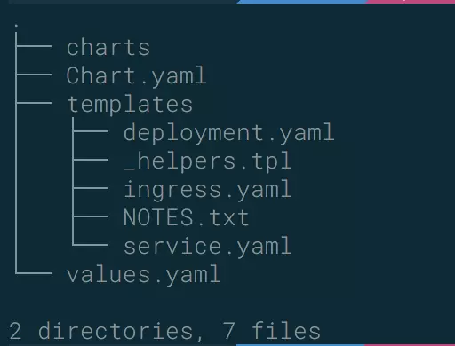
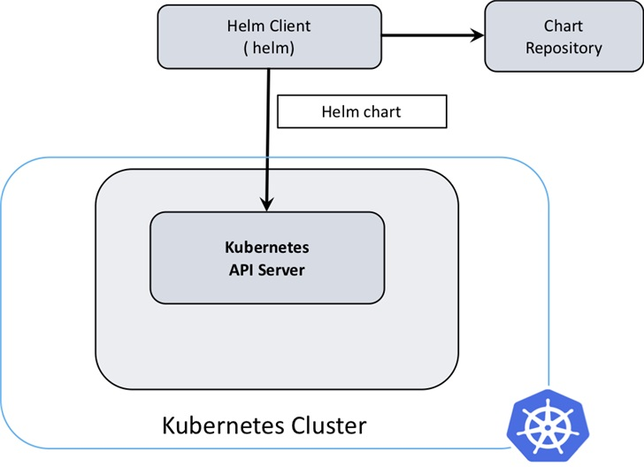
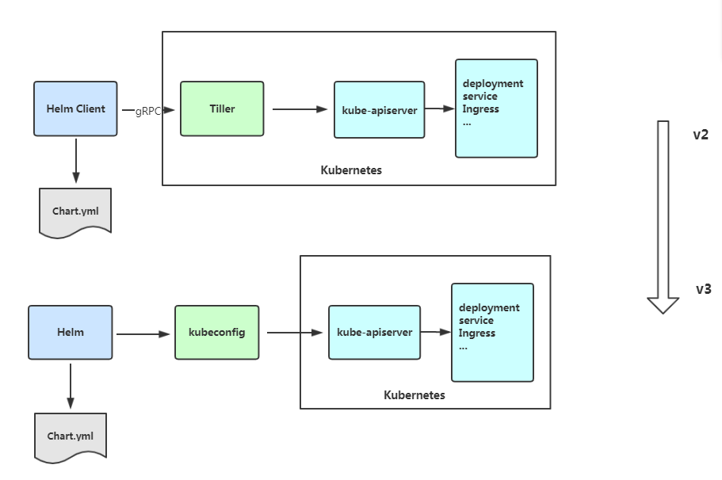

# helm 相关

### 一、组件及相关术语

##### 1、Helm

Helm 是一个命令行下的客户端工具。主要用于 k8s 应用程序 Chart 的创建、打包、发布以及创建和管理本地和远程的 Chart 仓库。

##### 2、Tiller

Tiller 是 Helm 的服务端，部署在 k8s 集群中。Tiller 用于接收 Helm 的请求，并根据 Chart 生成 k8s 的部署文件（Helm 称为 Release），然后提交给 k8s 创建应用。Tiller 还提供了 Release 的升级、删除、回滚等一些列功能。

##### 3、Chart

Helm 的软件包，采用 TAR 格式。类似于 APT 的 DEB 包或者 YUM 的 RPM 包，其包含了一组定义 k8s 资源相关的 YAML 文件。

##### 4、Repository

Helm 的软件仓库，Repository 本质上就是一个 Web 服务器，该服务器保存了一系列的 Chart 软件包以供用户下载，并且提供一个该 Repository 的 Chart 包的清单文件以供查询。Helm 可以同时管理多个不同的 Repository。

##### 5、Release

使用 helm install 命令在 k8s 集群中部署的 Chart 称为 Release。

> 注：helm 中提到的 Release 和我们通常概念中的版本有所不同，这里的 Release 可以理解为 Helm 使用 Chart 包部署的一个应用实例。

### 二、工作原理

#### 1、helm v2



#### Chart install 过程

1、Helm 从指定的目录或者 tgz 文件中解析出 Chart 结构信息

2、Helm 将指定的 Chart 结构和 Values 信息通过 gRPC 传递给 Tiller

3、Tiller 根据 Chart 和 Values 生成一个 Release

4、Tiller 将 Release 发送给 k8s 用于生成 Release

#### Chart Update 过程

1、Helm 从指定的目录或者 tgz 文件中解析出 Chart 结构信息

2、Helm 将要更新的 Release 的名称和 Chart 结构，Values 信息传递给 Tiller

3、Tiller 生成 Release 并更新指定名称的 Release 的 History

4、Tiller 将 Release 发给 k8s 用于更新 Release

#### Chart Rollback 过程

1、Helm 将要回滚的 Release 的名称传递给 Tiller

2、Tiller 根据 Release 的名称查找 History

3、Tiller 从 History 中获取上一个 Release

4、Tiller 将上一个 Release 发送给 k8s 用于替换当前 Release



* charts 目录存放依赖的chart

* Chart.yaml 包含Chart的基本信息，包括chart版本，名称等

* templates 目录下存放应用一系列 k8s 资源的 yaml 模板

* _helpers.tpl 此文件中定义一些可重用的模板片断，此文件中的定义在任何资源定义模板中可用

* NOTES.txt 介绍chart 部署后的帮助信息，如何使用chart等

* values.yaml 包含了必要的值定义（默认值）, 用于存储 templates 目录中模板文件中用到变量的值

#### 2、Helm v3





### 三、Helm 客户端安装（v3.0.0）

##### 1、使用官方脚本安装

```
curl https://raw.githubusercontent.com/helm/helm/master/scripts/get-helm-3 | bash
```

或

```
curl https://raw.githubusercontent.com/helm/helm/master/scripts/get-helm-3 > get_helm.sh
chmod 700 get_helm.sh
./get_helm.sh
```

##### 2、添加常用 Chart 源

```
#应该都不需要墙，stable是官方的，aliyuncs最快
helm repo add stable https://kubernetes-charts.storage.googleapis.com
helm repo add aliyuncs https://apphub.aliyuncs.com
helm repo add bitnami https://charts.bitnami.com/bitnami
```

##### 3、查看 Chart 源

```
helm repo list
```

##### 4、查找应用

```
helm search repo tomcat
```

##### 5、直接从 Chart 在线安装，需要实现创建动态存储卷等。

```
helm install my-tomcat aliyuncs/tomcat
```

```
NAME: my-tomcat
LAST DEPLOYED: Thu Dec  5 13:56:04 2019
NAMESPACE: default
STATUS: deployed
REVISION: 1
TEST SUITE: None
NOTES:
** Please be patient while the chart is being deployed **

1. Get the Tomcat URL by running:

** Please ensure an external IP is associated to the my-tomcat service before proceeding **
** Watch the status using: kubectl get svc --namespace default -w my-tomcat **

  export SERVICE_IP=$(kubectl get svc --namespace default my-tomcat --template "{{ range (index .status.loadBalancer.ingress 0) }}{{.}}{{ end }}")
  echo URL            : http://$SERVICE_IP/
  echo Management URL : http://$SERVICE_IP/manager

2. Login with the following credentials

  echo Username: user
  echo Password: $(kubectl get secret --namespace default my-tomcat -o jsonpath="{.data.tomcat-password}" | base64 --decode)
```

##### 6、离线安装

```
helm pull aliyuncs/tomcat
```

解压

```
tar -zxvf tomcat-6.0.5.tgz 

tomcat/Chart.yaml
tomcat/values.yaml
tomcat/templates/NOTES.txt
tomcat/templates/_helpers.tpl
tomcat/templates/deployment.yaml
tomcat/templates/ingress.yaml
tomcat/templates/pvc.yaml
tomcat/templates/secrets.yaml
tomcat/templates/svc.yaml
tomcat/.helmignore
```

修改 tomcat/values.yaml，改为 NodePort 方式，并取消动态存储卷配置。

```
vim tomcat/values.yaml
 
service:
  type: LoadBalancer
  # HTTP Port
  port: 80
 
改为
 
service:
  type: NodePort
  # HTTP Port
  port: 80
 
##########################
persistence:
  enabled: true
 
改为
 
persistence:
  enabled: false
```

离线安装 tomcat

```
helm install my-tomcat tomcat

NAME: my-tomcat
LAST DEPLOYED: Thu Dec  5 14:06:40 2019
NAMESPACE: default
STATUS: deployed
REVISION: 1
TEST SUITE: None
NOTES:
** Please be patient while the chart is being deployed **

1. Get the Tomcat URL by running:

  export NODE_PORT=$(kubectl get --namespace default -o jsonpath="{.spec.ports[0].nodePort}" services aa-tomcat)
  export NODE_IP=$(kubectl get nodes --namespace default -o jsonpath="{.items[0].status.addresses[0].address}")
  echo http://$NODE_IP:$NODE_PORT/

2. Login with the following credentials

  echo Username: user
  echo Password: $(kubectl get secret --namespace default aa-tomcat -o jsonpath="{.data.tomcat-password}" | base64 --decode)
```

### 四、常用功能

##### 1、创建一个 Chart 模板

```
helm create test
```

##### 2、打包 Chart 模板

```
helm package test
```

##### 3、查看 Chart 信息

```
helm show chart test-0.1.0.tgz
```

##### 4、先移除原先的仓库

```
helm repo remove stable
```

##### 5、添加新的仓库地址

```
helm repo add stable https://kubernetes.oss-cn-hangzhou.aliyuncs.com/charts
```

##### 6、更新仓库

```
helm repo update
```

### 五、使用 harbor 作为仓库存储 Charts

[https://github.com/goharbor/harbor-helm](https://github.com/goharbor/harbor-helm)

##### 1、添加 harbor repo

```
helm repo add goharbor https://helm.goharbor.io
```

##### 2、创建命名空间 test（可以跳过）

```
kubectl create namespace test
```

##### 3、查看当前context（可以跳过）

```
kubectl config current-context
```

##### 4、设置 context 指定对应的 namespace，不指定使用的是 default（可以跳过）

```
kubectl config set-context <current-context> --namespace test
```

> 这里是因为，helm 3 开始helm 3 的执行权限和kubectl config 的权限是一致的，通过kubectl config的方式来控制helm 3 的执行权限。

##### 5、可以提前拉取以下镜像（harbor-1.2.3）

```
docker pull goharbor/chartmuseum-photon:v0.9.0-v1.9.3
docker pull goharbor/redis-photon:v1.9.3
docker pull goharbor/clair-photon:v2.1.0-v1.9.3
docker pull goharbor/notary-server-photon:v0.6.1-v1.9.3
docker pull goharbor/notary-signer-photon:v0.6.1-v1.9.3
docker pull goharbor/harbor-registryctl:v1.9.3
docker pull goharbor/registry-photon:v2.7.1-patch-2819-2553-v1.9.3
docker pull goharbor/nginx-photon:v1.9.3
docker pull goharbor/harbor-jobservice:v1.9.3
docker pull goharbor/harbor-core:v1.9.3
docker pull goharbor/harbor-portal:v1.9.3
```

##### 6.1、安装 harbor， 关闭数据卷挂载，并使用 NodePort 方式进行访问。

```
helm -n test install harbor goharbor/harbor \
--set persistence.enabled=false \
--set expose.type=nodePort \
--set expose.tls.enabled=false \
--set externalURL=http://192.168.0.11:30002
```

参数说明：

- persistence.enabled=false 关闭存储，为了方便操作，真实使用时需要挂在存储
- expose.type=nodePort 使用 NodePort 访问
- expose.tls.enabled=false 关闭tls
- externalURL=http://192.168.0.11:30002 设置登录 harbor 的外部链接

##### 6.2、配置 harbor 使用  Ceph 持续存储（根据情况可选）

###### 查看已有的 storageclasses

```
kubectl get sc
NAME       PROVISIONER    AGE
ceph-rbd   ceph.com/rbd   8h
```

###### 下载 harbor

```
helm pull goharbor/harbor
```

###### 解压

```
tar -zxvf harbor-1.2.3.tgz
```

###### vim harbor/values.yaml

```
expose:
	type: nodePort
	tls:
		enabled: false
externalURL: http://192.168.0.11:30002
persistence:
	persistentVolumeClaim:
		registry:
			# 所有 storageClass 都修改为以下内容
			storageClass: "ceph-rbd"
```

###### 部署

```
helm install harbor harbor/
```

##### 7、访问界面登录 http://192.168.0.11:30002 

>  默认账号密码 admin/Harbor12345

##### 8、添加仓库 chart_repo

##### 9、创建用户 hl/XXX

##### 10.1、添加 repo 到 helm

```
helm repo add hl http://192.168.0.11:30002/chartrepo/chart_repo
```

##### 10.2、添加 repo 到 helm，及添加认证信息（根据情况可选）

```
helm repo add hl http://192.168.0.11:30002/chartrepo/chart_repo --username hl_user --password hl_password
```

##### 11、安装 helm-push 插件

```
helm plugin install https://github.com/chartmuseum/helm-push
```

##### 12、push charts 到 harbor 里面

```
helm push grafana-0.0.2.tgz test --username hl --password xxx
```

### 六、其他

##### 1、helm hub

[helm hub](https://hub.helm.sh/)

##### 2、helm 官网

[https://v3.helm.sh/docs/](https://v3.helm.sh/docs/)